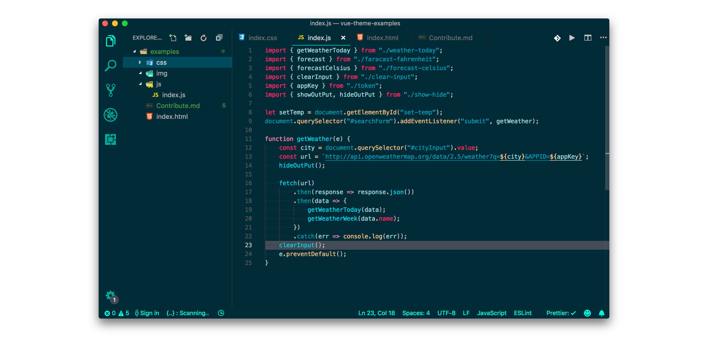

## Built With

- [vscode](https://code.visualstudio.com/download) - VS Code editor
- [yo code](https://code.visualstudio.com/docs/extensions/yocode) - Extension Generator
- [vsce](https://code.visualstudio.com/docs/extensions/publish-extension) - Publishing Tool Reference

### Installing

1.  Open **Extensions** sidebar panel in VS Code: `View → Extensions`
2.  Search for `Vue Theme` - by **Mario Rodeghiero**
3.  Click **Install** to install it.
4.  Click **Reload** to reload the your editor
5.  Code > Preferences > Color Theme > **Vue Theme**

## Color Palette

Palette      | Hex       
---          | ---       
Background   | `#002b36` 
Active Border | `#19f9d8`
selectionBackground    | `#46494d87`
Foreground   | `#e6e6e6`
Comment      | `#8a8787`
Cyan         | `#09cbdd`
Green        | `#19f9d8`
Orange       | `#ff5622de`
Pink         | `#f48fb1`
Red          | `#ee475e`
Yellow       | `#ffcc95`

## Contributing

Please read [CONTRIBUTING.md](CONTRIBUTING.md) for details on our code of conduct, and the process for submitting pull requests to us.

## Author

- [Mário Antônio do Amaral Rodeghiero](https://github.com/mariorodeghiero)

## Contributors

|  |  |  |  |
| ------------------------------------------------------------------------------------------------------------------------ | ----------------------------------------------------------------------------------------------------------------- | -------------------------------------------------------------------------------------------------------- |-------------------------------------------------------------------------------------------------------- |
| [Mário Rodeghiero 💻](https://github.com/mariorodeghiero)                                                                | [Roberto Achar 💻](https://github.com/robertoachar)                                                               | [Saamiyah 💻](https://github.com/Saamiyah)                                                               |[rafael-santos 💻](https://github.com/rafael-santos)                                                               |

<!-- ## Sponsors

Support this project by becoming a sponsor. Your logo will show up here with a link to your website. [[Become a sponsor](https://opencollective.com/vue-theme#sponsor)] -->

## License

This project is licensed under the MIT License - see the [LICENSE.md](LICENSE.md) file for details

## Acknowledgments

- [**Roberto Achar**](https://github.com/robertoachar) - For some ideas that helped me to develop this theme.
